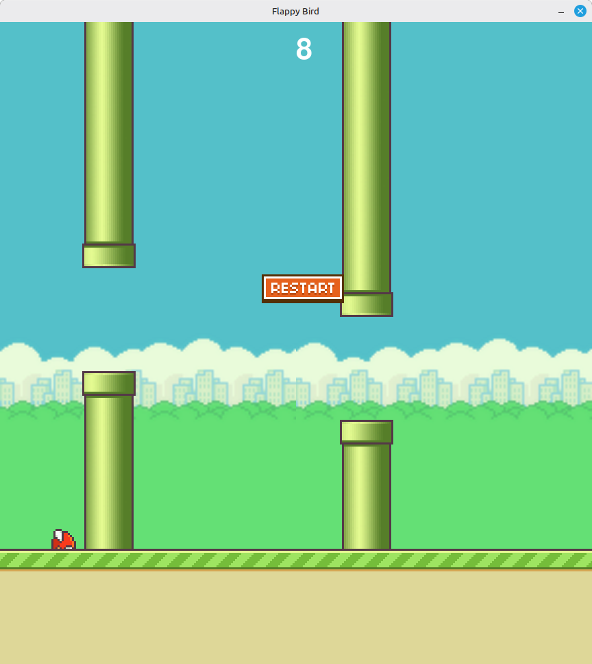

# Flappy Bird 🐦

A Python implementation of the classic Flappy Bird game using Pygame.

## 📸 Screenshot
 *Add your screenshot here*

## 🚀 Quick Start

### Prerequisites
- Python 3.7+
- Pygame 2.0+

### Installation
1. Clone the repository:
```bash
git clone https://github.com/yourusername/flappy-bird.git
cd flappy-bird